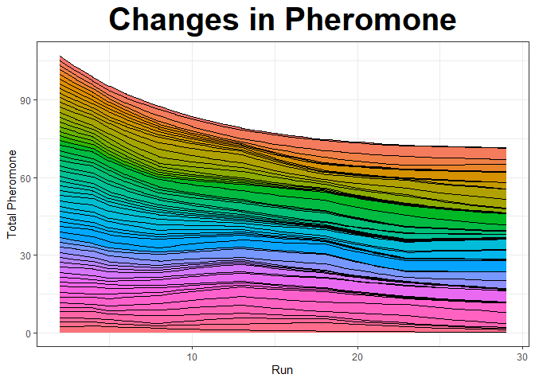
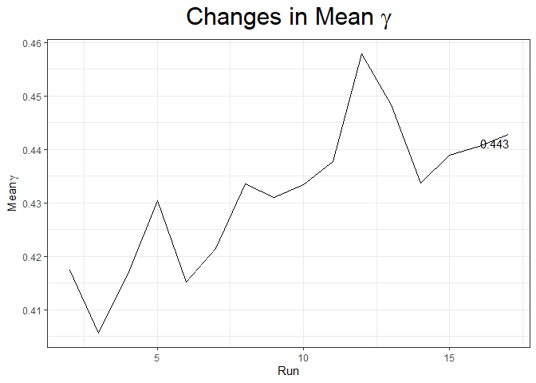
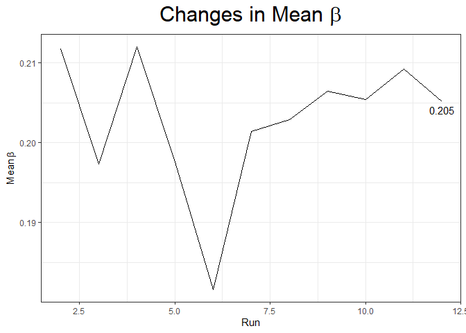
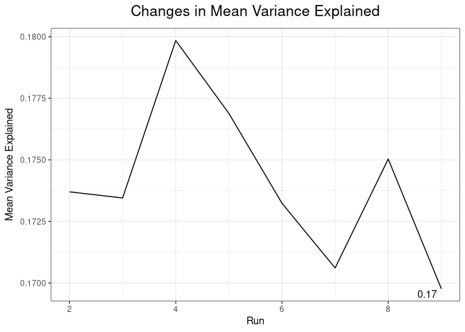
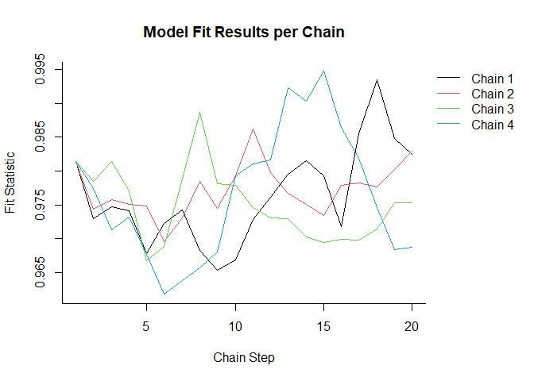
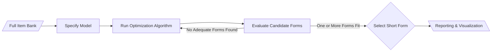

# ShortForm

[](https://cran.r-project.org/package=ShortForm)
[](https://github.com/AnthonyRaborn/ShortForm/actions/workflows/R-CMD-check.yaml)
[](https://cran.r-project.org/package=ShortForm)
[](https://cran.r-project.org/package=ShortForm)

## Overview

**ShortForm** is an R package for constructing short-form assessments
from larger item banks using reproducible, optimization-based workflows.

It provides implementations of metaheuristic search algorithms to
automate item selection while preserving prespecified psychometric
properties. The package is designed for researchers and practitioners
who need scalable, transparent, and reproducible methods for reducing
assessment length.

------------------------------------------------------------------------

## Key Features

- Automated short-form construction from full item banks
- Multiple optimization algorithms:
  - Ant Colony Optimization (ACO)
  - Tabu Search (TS)
  - Simulated Annealing (SA)
- Integration with `lavaan` and `Mplus` workflows
- Support for custom objective functions and model specifications
- Reproducible, scriptable workflows for assessment design

------------------------------------------------------------------------

## Use Cases

ShortForm is useful when you need to:

- Reduce assessment length while maintaining measurement validity
- Automate item selection workflows for large-scale assessments
- Build reproducilbe pipelines for psychometric modeling and evaluation

------------------------------------------------------------------------

## Engineering Highlights

This package demonstrates:

- Development and maintenance of an R package distributed via CRAN
- Implementation of optimization algorithms for applied statistical
  workflows
- Automated build and testing pipelines using CI/CD
- Integration with other modeling tools
- Reproducible examples using structured simulated data

------------------------------------------------------------------------

This document was created on 2026-05-06.

## Installation

``` r
install.packages("ShortForm") # the CRAN-approved version
require("devtools")
devtools::install_github("AnthonyRaborn/ShortForm", branch = "devel") # the developmental version
```

## Quick Examples

``` r
set.seed(58310)
library(ShortForm)
##  Package 'ShortForm' version 0.5.7

# Example workflow:
# 1. Define item pool and model
# 2. Run optimization algorithm
# 3. Evaluate resulting short form

result_ACO <- antcolony.lavaan(
    data = simulated_test_data,
    antModel = exampleAntModel,
    list.items = list(paste0("Item", 1:56)), 
    full = 56, i.per.f = 15,
    factors = "Ability", 
    steps = 100,
    fit.indices = c("cfi", "rmsea"),
    fit.statistics.test = "(cfi > 0.98)&(rmsea < 0.03)",
    summaryfile = NULL,
    feedbackfile = NULL,
    max.run = 200
)
##   Run number 1 and ant number 1.            Run number 1 and ant number 2.            Run number 1 and ant number 3.            Run number 1 and ant number 4.            Run number 1 and ant number 5.            Run number 1 and ant number 6.            Run number 1 and ant number 7.            Run number 1 and ant number 8.            Run number 1 and ant number 9.            Run number 1 and ant number 10.            Run number 1 and ant number 11.            Run number 1 and ant number 12.            Run number 1 and ant number 13.            Run number 1 and ant number 14.            Run number 1 and ant number 15.            Run number 1 and ant number 16.            Run number 1 and ant number 17.            Run number 1 and ant number 18.            Run number 1 and ant number 19.            Run number 1 and ant number 20.            Run number 2 and ant number 1.            Run number 2 and ant number 2.            Run number 2 and ant number 3.            Run number 2 and ant number 4.            Run number 2 and ant number 5.            Run number 2 and ant number 6.            Run number 2 and ant number 7.            Run number 2 and ant number 8.            Run number 2 and ant number 9.            Run number 2 and ant number 10.            Run number 2 and ant number 11.            Run number 2 and ant number 12.            Run number 2 and ant number 13.            Run number 2 and ant number 14.            Run number 2 and ant number 15.            Run number 2 and ant number 16.            Run number 2 and ant number 17.            Run number 2 and ant number 18.            Run number 2 and ant number 19.            Run number 2 and ant number 20.            Run number 3 and ant number 1.            Run number 3 and ant number 2.            Run number 3 and ant number 3.            Run number 3 and ant number 4.            Run number 3 and ant number 5.            Run number 3 and ant number 6.            Run number 3 and ant number 7.            Run number 3 and ant number 8.            Run number 3 and ant number 9.            Run number 3 and ant number 10.            Run number 3 and ant number 11.            Run number 3 and ant number 12.            Run number 3 and ant number 13.            Run number 3 and ant number 14.            Run number 3 and ant number 15.            Run number 3 and ant number 16.            Run number 3 and ant number 17.            Run number 3 and ant number 18.            Run number 3 and ant number 19.            Run number 3 and ant number 20.            Run number 4 and ant number 1.            Run number 4 and ant number 2.            Run number 4 and ant number 3.            Run number 4 and ant number 4.            Run number 4 and ant number 5.            Run number 4 and ant number 6.            Run number 4 and ant number 7.            Run number 4 and ant number 8.            Run number 4 and ant number 9.            Run number 4 and ant number 10.            Run number 4 and ant number 11.            Run number 4 and ant number 12.            Run number 4 and ant number 13.            Run number 4 and ant number 14.            Run number 4 and ant number 15.            Run number 4 and ant number 16.            Run number 4 and ant number 17.            Run number 4 and ant number 18.            Run number 4 and ant number 19.            Run number 4 and ant number 20.            Run number 5 and ant number 1.            Run number 5 and ant number 2.            Run number 5 and ant number 3.            Run number 5 and ant number 4.            Run number 5 and ant number 5.            Run number 5 and ant number 6.            Run number 5 and ant number 7.            Run number 5 and ant number 8.            Run number 5 and ant number 9.            Run number 5 and ant number 10.            Run number 5 and ant number 11.            Run number 5 and ant number 12.            Run number 5 and ant number 13.            Run number 5 and ant number 14.            Run number 5 and ant number 15.            Run number 5 and ant number 16.            Run number 5 and ant number 17.            Run number 5 and ant number 18.            Run number 5 and ant number 19.            Run number 5 and ant number 20.            Run number 6 and ant number 1.            Run number 6 and ant number 2.            Run number 6 and ant number 3.            Run number 6 and ant number 4.            Run number 6 and ant number 5.            Run number 6 and ant number 6.            Run number 6 and ant number 7.            Run number 6 and ant number 8.            Run number 6 and ant number 9.            Run number 6 and ant number 10.            Run number 6 and ant number 11.            Run number 6 and ant number 12.            Run number 6 and ant number 13.            Run number 6 and ant number 14.            Run number 6 and ant number 15.            Run number 6 and ant number 16.            Run number 6 and ant number 17.            Run number 6 and ant number 18.            Run number 6 and ant number 19.            Run number 6 and ant number 20.            Run number 7 and ant number 1.            Run number 7 and ant number 2.            Run number 7 and ant number 3.            Run number 7 and ant number 4.            Run number 7 and ant number 5.            Run number 7 and ant number 6.            Run number 7 and ant number 7.            Run number 7 and ant number 8.            Run number 7 and ant number 9.            Run number 7 and ant number 10.            Run number 7 and ant number 11.            Run number 7 and ant number 12.            Run number 7 and ant number 13.            Run number 7 and ant number 14.            Run number 7 and ant number 15.            Run number 7 and ant number 16.            Run number 7 and ant number 17.            Run number 7 and ant number 18.            Run number 7 and ant number 19.            Run number 7 and ant number 20.            Run number 8 and ant number 1.            Run number 8 and ant number 2.            Run number 8 and ant number 3.            Run number 8 and ant number 4.            Run number 8 and ant number 5.            Run number 8 and ant number 6.            Run number 8 and ant number 7.            Run number 8 and ant number 8.            Run number 8 and ant number 9.            Run number 8 and ant number 10.            Run number 8 and ant number 11.            Run number 8 and ant number 12.            Run number 8 and ant number 13.            Run number 8 and ant number 14.            Run number 8 and ant number 15.            Run number 8 and ant number 16.            Run number 8 and ant number 17.            Run number 8 and ant number 18.            Run number 8 and ant number 19.            Run number 8 and ant number 20.            Run number 9 and ant number 1.            Run number 9 and ant number 2.            Run number 9 and ant number 3.            Run number 9 and ant number 4.            Run number 9 and ant number 5.            Run number 9 and ant number 6.            Run number 9 and ant number 7.            Run number 9 and ant number 8.            Run number 9 and ant number 9.            Run number 9 and ant number 10.            Run number 9 and ant number 11.            Run number 9 and ant number 12.            Run number 9 and ant number 13.            Run number 9 and ant number 14.            Run number 9 and ant number 15.            Run number 9 and ant number 16.            Run number 9 and ant number 17.            Run number 9 and ant number 18.            Run number 9 and ant number 19.            Run number 9 and ant number 20.            Run number 10 and ant number 1.            Run number 10 and ant number 2.            Run number 10 and ant number 3.            Run number 10 and ant number 4.            Run number 10 and ant number 5.            Run number 10 and ant number 6.            Run number 10 and ant number 7.            Run number 10 and ant number 8.            Run number 10 and ant number 9.            Run number 10 and ant number 10.            Run number 10 and ant number 11.            Run number 10 and ant number 12.            Run number 10 and ant number 13.            Run number 10 and ant number 14.            Run number 10 and ant number 15.            Run number 10 and ant number 16.            Run number 10 and ant number 17.            Run number 10 and ant number 18.            Run number 10 and ant number 19.            Run number 10 and ant number 20.            Run number 11 and ant number 1.            Run number 11 and ant number 2.            Run number 11 and ant number 3.            Run number 11 and ant number 4.            Run number 11 and ant number 5.            Run number 11 and ant number 6.            Run number 11 and ant number 7.            Run number 11 and ant number 8.            Run number 11 and ant number 9.            Run number 11 and ant number 10.            Run number 11 and ant number 11.            Run number 11 and ant number 12.            Run number 11 and ant number 13.            Run number 11 and ant number 14.            Run number 11 and ant number 15.            Run number 11 and ant number 16.            Run number 11 and ant number 17.            Run number 11 and ant number 18.            Run number 11 and ant number 19.            Run number 11 and ant number 20.           [1] "Compiling results."

summary(result_ACO)
##  Algorithm: Ant Colony Optimization
##  Total Run Time: 16.489 secs
##  
##  lavaan 0.6-21 ended normally after 49 iterations
##  
##    Estimator                                         ML
##    Optimization method                           NLMINB
##    Number of model parameters                        32
##  
##    Number of observations                          1000
##  
##  Model Test User Model:
##                                                        
##    Test statistic                               110.479
##    Degrees of freedom                               104
##    P-value (Chi-square)                           0.313
##  
##  
##  Final Model Syntax:
##  Ability =~ Item10 + Item11 + Item12 + Item13 + Item17 + Item19 + Item2 + Item27
##    + Item37 + Item42 + Item44 + Item53 + Item54 + Item6 + Item9
##  Outcome ~ Ability
plot(result_ACO)
##  Warning: Using `size` aesthetic for lines was deprecated in ggplot2 3.4.0.
##  ℹ Please use `linewidth` instead.
##  ℹ The deprecated feature was likely used in the ShortForm package.
##    Please report the issue at
##    <https://github.com/AnthonyRaborn/ShortForm/issues>.
##  This warning is displayed once per session.
##  Call `lifecycle::last_lifecycle_warnings()` to see where this warning was
##  generated.
##  $Pheromone
```

<!-- -->

    ##  
    ##  $Gamma

<!-- -->

    ##  
    ##  $Beta

<!-- -->

    ##  
    ##  $Variance

<!-- -->

``` r
set.seed(58310)
result_SA <- simulatedAnnealing(
  initialModel = paste("Ability =~", paste0("Item", 1:56, collapse = " + ")),
  originalData = simulated_test_data,
  maxSteps = 20, 
  maxItems = 40, 
  items = paste0("Item", 1:56),
  setChains = 4
)
##  Initializing short form creation.
##  The initial short form is:
##  Ability =~ Item10 + Item43 + Item35 + Item31 + Item42 + Item49 + Item48 + Item20 + Item32 + Item18 + Item36 + Item34 + Item45 + Item50 + Item3 + Item54 + Item2 + Item44 + Item24 + Item7 + Item22 + Item46 + Item53 + Item13 + Item39 + Item38 + Item51 + Item21 + Item15 + Item56 + Item8 + Item29 + Item40 + Item26 + Item23 + Item47 + Item1 + Item52 + Item27 + Item9
##  
##  Using the short form randomNeighbor function.
##  Finished initializing short form options.
##   Current Progress: 
##  Chain number 1 complete. 
##  Chain number 2 complete. 
##  Chain number 3 complete. 
##  Chain number 4 complete.

summary(result_SA)
##  Algorithm: Simulated Annealing
##  Total Run Time: 3.209 mins
##  
##  lavaan 0.6-21 ended normally after 31 iterations
##  
##    Estimator                                         ML
##    Optimization method                           NLMINB
##    Number of model parameters                        80
##  
##    Number of observations                          1000
##  
##  Model Test User Model:
##                                                        
##    Test statistic                               770.183
##    Degrees of freedom                               740
##    P-value (Chi-square)                           0.214
##  
##  
##  Final Model Syntax:
##  Ability =~ Item10 + Item43 + Item35 + Item31 + Item42 + Item49 + Item48 + Item20
##    + Item32 + Item18 + Item36 + Item34 + Item45 + Item50 + Item3 + Item54 +
##    Item2 + Item44 + Item24 + Item7 + Item22 + Item46 + Item19 + Item13 + Item39 +
##    Item38 + Item51 + Item21 + Item15 + Item56 + Item8 + Item29 + Item40 + Item26
##    + Item23 + Item17 + Item1 + Item52 + Item27 + Item4
plot(result_SA)
```

<!-- -->

``` r
set.seed(58310)
shortAntModel <- "
Ability =~ Item1 + Item2 + Item3 + Item4 + Item5 + Item6 + Item7 + Item8
Ability ~ Outcome
"

result_TS <- tabuShortForm(
  initialModel = shortAntModel,
  originalData = simulated_test_data, numItems = 7,
  niter = 1, tabu.size = 3, parallel = FALSE
)
##  Running iteration 1 of 1.
summary(result_TS)
##  Algorithm: Tabu Search
##  Total Run Time: 2.418 secs
##  
##  lavaan 0.6-21 ended normally after 29 iterations
##  
##    Estimator                                         ML
##    Optimization method                           NLMINB
##    Number of model parameters                        15
##  
##    Number of observations                          1000
##  
##  Model Test User Model:
##                                                        
##    Test statistic                                18.858
##    Degrees of freedom                                20
##    P-value (Chi-square)                           0.531
##  
##  
##  Final Model Syntax:
##  Ability =~ Item1 + Item6 + Item3 + Item4 + Item5 + Item7 + Item8
##  Ability ~ Outcome
```

## Workflow



## Outputs

ShortForm produces diagnostic outputs such as:

- Objective function convergence plots
- Algorithm-specific diagnostics
- Summary statistics for selected item sets

------------------------------------------------------------------------

## Algorithms

### Ant Colony Optimization (ACO)

Implementation adapted from [Leite, Huang, & Marcoulides
(2008)](https://doi.org/10.1080/00273170802285743).

### Tabu Search (TS)

Based on [Marcoulides & Falk
(2018)](https://doi.org/10.1080/10705511.2017.1409074), extended for
model search and short-form construction.

### Simulated Annealing (SA)

Provides one of the first implementations of simulated annealing for
psychometric model selection workflows. Implemented following
[Kirkpatrick et
al. (1983)](https://doi.org/10.1126/science.220.4598.671).

------------------------------------------------------------------------

## Performance Notes

Computational time depends on:

- Number and types of items
- Dimensionality/model complexity
- Algorithm convergence settings

Parallelization is supported for certain workflows.

------------------------------------------------------------------------

## Reproducibility

ShortForm is designed for reproducible analytical workflows:

- Fully scriptable
- Compatible with R Markdown and Quarto
- Supports integration into larger modeling pipelines

------------------------------------------------------------------------

## Reproducible Docker Environment

This repository includes a Dockerfile for building and checking the
package in a clean R environment.

``` bash
docker build -t shortform-r .
```

The Docker build installs package dependencies, builds the package
source tarball, and runs R CMD check on the built package. This provides
an additional reproducibility check alongside the GitHub Actions CI
workflow.

------------------------------------------------------------------------

## License

LGPL (\>= 2.0, \< 3) \| Mozilla Public License

------------------------------------------------------------------------

## Citation

If you use this package, please cite:

Raborn A, Leite W (2024). *ShortForm: Automatic Short Form Creation*.
<doi:10.32614/CRAN.package>. ShortForm
<https://doi.org/10.32614/CRAN.package.ShortForm>, R package version
0.5.6, <https://CRAN.R-project.org/package=ShortForm>.
